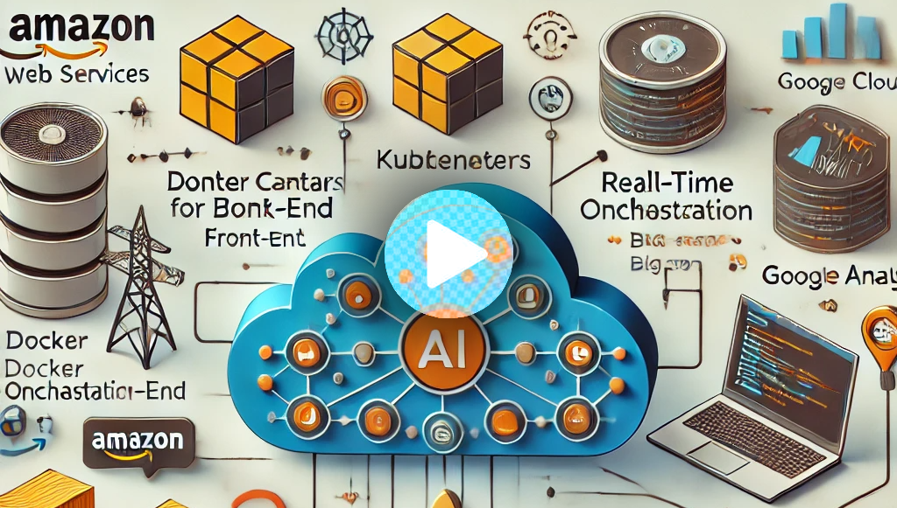

# CloudMart - Multi-Cloud E-Commerce Application

## Overview

CloudMart is a **multi-cloud** e-commerce platform that integrates **AWS**, **Google Cloud**, **Microsoft Azure**, and **OpenAI** technologies. This platform provides a scalable, AI-powered solution for product recommendations, customer support, and sentiment analysis. The project leverages **Terraform** for infrastructure management, **Docker** for containerization, **Kubernetes** for deployment, **Lambda** functions for serverless processing, **BigQuery** for analytics, and **CI/CD pipelines** using **AWS CodePipeline**.

## Demo Video

[](https://player.vimeo.com/video/1055755843?title=0&byline=0&portrait=0&badge=0&autopause=0&player_id=0&app_id=58479)

## Technology Stack

- **Cloud Infrastructure**:
  - AWS EKS (Kubernetes)
  - AWS DynamoDB
  - AWS Lambda
  - Google Cloud BigQuery
- **AI Services**:
  - Amazon Bedrock with Claude 3 Sonnet
  - OpenAI GPT-4
  - Azure Text Analytics
- **Application Stack**:
  - Frontend: Node.js
  - Backend: Node.js
  - Containerization: Docker
  - Infrastructure as Code: Terraform

---

## Prerequisites

Ensure you have the following installed before proceeding:

- **Docker**: For containerizing both frontend and backend.
- **kubectl**: For interacting with Kubernetes clusters.
- **AWS CLI**: For managing AWS resources.
- **Google Cloud SDK**: For managing Google Cloud services.
- **Azure CLI**: For managing Azure resources.
- **Terraform**: For managing infrastructure as code.

---

## Setup Process

### Step 1: **Google Cloud BigQuery Setup**

1. **Create a Google Cloud Project**:

   - Go to the [Google Cloud Console](https://console.cloud.google.com/).
   - Select "New Project", name it `CloudMart`, and create it.

2. **Enable BigQuery API**:

   - Go to "APIs & Services" > "Dashboard".
   - Click "+ ENABLE APIS AND SERVICES" and search for "BigQuery API".
   - Enable the API.

3. **Create a BigQuery Dataset**:

   - In BigQuery, create a dataset with the ID `cloudmart`.

4. **Create a BigQuery Table**:

   - Inside the `cloudmart` dataset, create a table named `cloudmart-orders`.
   - Define the schema for `cloudmart-orders` (e.g., `id`, `items`, `userEmail`, `total`, `status`, `createdAt`).

5. **Create Service Account and Key**:
   - Create a service account with the "BigQuery Data Editor" role.
   - Download the service account key as `google_credentials.json`.

---

### Step 2: **AWS EC2 Setup**

1. **Create IAM Role for EC2**:

   - Navigate to IAM in the AWS Console.
   - Create an IAM role for EC2 with "AdministratorAccess" policy.

2. **Launch EC2 Instance**:

   - Launch an EC2 instance with the Amazon Linux 2 AMI and `t2.micro` type.
   - Assign the previously created IAM role "EC2Admin".
   - Add a security group allowing SSH access.

3. **Connect to EC2 Instance**:
   - Connect using EC2 Instance Connect.
   - Update system packages with:
     ```bash
     sudo yum update -y
     sudo yum install -y yum-utils
     sudo yum-config-manager --add-repo https://rpm.releases.hashicorp.com/AmazonLinux/hashicorp.repo
     sudo yum -y install terraform
     terraform version
     ```

---

### Step 3: **Terraform Setup**

1. **Create Terraform Configuration**:

   - In the `terraform-project` directory, create a `main.tf` file with the following content:

     ```hcl
     provider "aws" {
       region = "us-east-1"
     }

     resource "aws_dynamodb_table" "cloudmart_products" {
       name           = "cloudmart-products"
       billing_mode   = "PAY_PER_REQUEST"
       hash_key       = "id"
       attribute {
         name = "id"
         type = "S"
       }
     }

     resource "aws_dynamodb_table" "cloudmart_orders" {
       name           = "cloudmart-orders"
       billing_mode   = "PAY_PER_REQUEST"
       hash_key       = "id"
       attribute {
         name = "id"
         type = "S"
       }
       stream_enabled   = true
       stream_view_type = "NEW_AND_OLD_IMAGES"
     }

     resource "aws_dynamodb_table" "cloudmart_tickets" {
       name           = "cloudmart-tickets"
       billing_mode   = "PAY_PER_REQUEST"
       hash_key       = "id"
       attribute {
         name = "id"
         type = "S"
       }
     }

     resource "aws_lambda_function" "list_products" {
       filename         = "list_products.zip"
       function_name    = "cloudmart-list-products"
       role             = aws_iam_role.lambda_role.arn
       handler          = "index.handler"
       runtime          = "nodejs20.x"
       source_code_hash = filebase64sha256("list_products.zip")
       environment {
         variables = {
           PRODUCTS_TABLE = aws_dynamodb_table.cloudmart_products.name
         }
       }
     }

     resource "aws_lambda_permission" "allow_bedrock" {
       statement_id  = "AllowBedrockInvoke"
       action        = "lambda:InvokeFunction"
       function_name = aws_lambda_function.list_products.function_name
       principal     = "bedrock.amazonaws.com"
     }

     output "list_products_function_arn" {
       value = aws_lambda_function.list_products.arn
     }
     ```

   - Run:
     ```bash
     terraform init
     terraform plan
     terraform apply
     ```

---

### Step 4: **Kubernetes Deployment**

1. **Set up AWS EKS Cluster**:

   - Create a Kubernetes cluster using `eksctl`:
     ```bash
     eksctl create cluster --name cloudmart --region us-east-1 --nodegroup-name standard-workers --node-type t3.medium --nodes 1 --with-oidc --managed
     ```

2. **Deploy Backend & Frontend**:

   - Create Docker images for both frontend and backend.
   - Deploy using `kubectl` with the following YAML for the backend and frontend.

   - Backend Deployment Example:
     ```yaml
     apiVersion: apps/v1
     kind: Deployment
     metadata:
       name: cloudmart-backend-app
     spec:
       replicas: 1
       selector:
         matchLabels:
           app: cloudmart-backend-app
       template:
         metadata:
           labels:
             app: cloudmart-backend-app
         spec:
           containers:
             - name: cloudmart-backend-app
               image: <YOUR_IMAGE>
               env:
                 - name: PORT
                   value: "5000"
     ```

---

### Step 5: **CI/CD Pipeline with CodePipeline**

1. **Create a GitHub Repository** for the source code.
2. **Set up AWS CodePipeline**:
   - Configure a new pipeline with GitHub as the source.
   - Add stages for Build and Deploy.
   - Use AWS CodeBuild to build the Docker image and push it to ECR.
3. **Configure CodeBuild** to build the Docker image and deploy the application to Kubernetes.

---

### Step 6: **AI Integration**

1. **Configure Amazon Bedrock Agent** for product recommendations:

   - Create a "cloudmart-product-recommendation-agent" using Claude 3 Sonnet.
   - Set up IAM roles and policies for invoking Lambda functions from Bedrock.
   - Configure action groups to execute the Lambda function and query the product list.

2. **Set up OpenAI Assistant** for CloudMart customer support:
   - Create an assistant with GPT-4 and set the configuration to handle customer inquiries.

---

### Step 7: **Final Deployment & Testing**

1. Deploy the full application, including frontend and backend, to AWS using Kubernetes and EKS.
2. Test the AI chatbots and product recommendation system.
3. Verify real-time data synchronization between DynamoDB and BigQuery.

---

## Removal of Resources

1. To avoid unwanted charges, delete the resources after usage:

   ```bash
   kubectl delete service cloudmart-frontend-app-service
   kubectl delete deployment cloudmart-frontend-app
   kubectl delete service cloudmart-backend-app-service
   kubectl delete deployment cloudmart-backend-app

   eksctl delete cluster --name cloudmart --region us-east-1
   ```

---

### **Notes:**

- Ensure all **required API keys** for OpenAI, Bedrock, and Azure are correctly configured in environment variables.
- **Security Considerations**: Never commit sensitive information like API keys or credentials to version control. Always use environment variables or secure storage for secrets.
